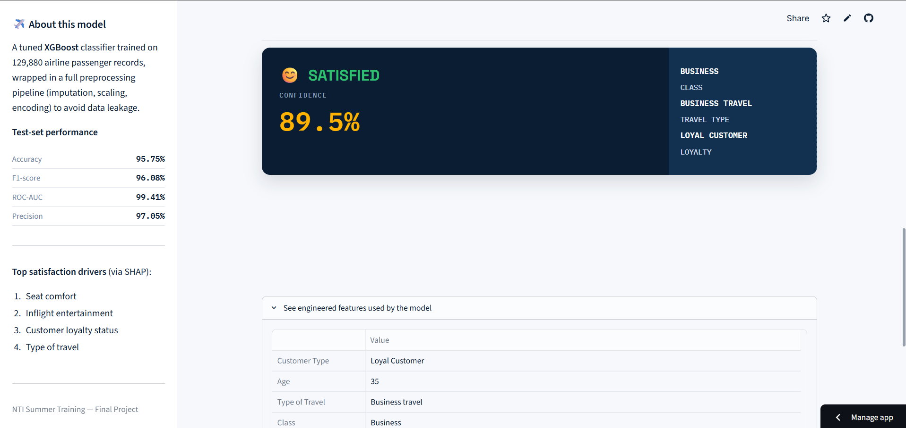

# ✈️ Airline Customer Satisfaction Prediction & Analysis


A complete end-to-end Machine Learning project that predicts whether an airline passenger is **Satisfied** or **Dissatisfied**, based on flight details, service ratings, and delay information — including full EDA, feature engineering, model comparison, explainability (SHAP), and a deployed Streamlit web app.

🔗 **Live App:** [airline-satisfaction-app1.streamlit.app](https://airline-satisfaction-app1.streamlit.app/)
📂 **Repository:** [github.com/mohamed-abass-1/airline-satisfaction-app](https://github.com/mohamed-abass-1/airline-satisfaction-app)

---

## 📌 Project Overview

This project analyzes airline customer satisfaction data and builds a binary classification model to predict passenger satisfaction. Beyond prediction, the project focuses on **explaining** what drives satisfaction and translating those findings into actionable business recommendations for the airline.

**Problem type:** Binary Classification
**Target variable:** `satisfaction` → `Satisfied` / `Dissatisfied`

---

## 🗂️ Dataset

- **Size:** 129,880 rows × 22 columns
- **Source:** Airline passenger satisfaction survey data (customer demographics, flight details, 14 in-flight/ground service ratings, and delay information)
- **Class balance:** ~54.7% Satisfied / ~45.3% Dissatisfied

---

## 🔬 Methodology

| Stage | What was done |
|---|---|
| **Data Understanding & Cleaning** | Checked structure, missing values, duplicates, and valid ranges. Imputed the only missing column (`Arrival Delay in Minutes`) using the median due to heavy right-skew. |
| **EDA** | Univariate, categorical, bivariate, and multivariate analysis (correlation heatmap) to identify key satisfaction drivers. |
| **Outlier Analysis** | IQR-based detection; no values removed blindly — delays and long flights were confirmed to be genuine, not data errors. |
| **Feature Engineering** | Created `Total Delay`, `Delay Category`, `Service Score`, `Age Group`, and `Flight Distance Category`, each validated against the target before inclusion. |
| **Feature Selection** | Mutual Information + Random Forest importance to rank predictive features. |
| **Preprocessing** | `ColumnTransformer` + `Pipeline` (imputation, scaling, one-hot encoding) to prevent data leakage. |
| **Modeling** | Trained and compared 5 models: Logistic Regression, Decision Tree, Random Forest, Gradient Boosting, and XGBoost. |
| **Validation** | 5-fold Stratified Cross-Validation to confirm stability of results. |
| **Hyperparameter Tuning** | `RandomizedSearchCV` on the best-performing model (XGBoost). |
| **Overfitting Check** | Train vs. test performance gap analysis across all models. |
| **Explainability** | SHAP (`TreeExplainer`) to interpret individual predictions and global feature impact. |
| **Business Analysis** | Translated model + EDA findings into concrete improvement recommendations. |
| **Deployment** | Final tuned pipeline saved with `joblib` and served through a Streamlit web app. |

---

## 📊 Model Performance

| Model | Accuracy | Precision | Recall | F1-Score | ROC-AUC |
|---|---|---|---|---|---|
| Logistic Regression | 0.831 | 0.846 | 0.846 | 0.846 | 0.905 |
| Decision Tree | 0.934 | 0.939 | 0.940 | 0.940 | 0.933 |
| Gradient Boosting | 0.923 | 0.932 | 0.928 | 0.930 | 0.980 |
| Random Forest | 0.954 | 0.966 | 0.950 | 0.958 | 0.992 |
| **XGBoost (tuned)** | **0.958** | **0.971** | **0.951** | **0.961** | **0.994** |

**Final model:** Tuned XGBoost, selected for its top performance across all metrics combined with fast training time — a practical advantage during hyperparameter search.

---

## 💡 Key Insights

- **Seat comfort** and **Inflight entertainment** are the strongest drivers of satisfaction — confirmed independently by correlation analysis, feature importance, and SHAP.
- **Seat comfort** is simultaneously the lowest-rated service *and* the highest-impact feature — the single highest-priority area for improvement.
- **Customer loyalty status** has a major effect: Loyal customers report 61.6% satisfaction vs. only 24% for disloyal customers.
- **Flight delays have a relatively minor effect** on satisfaction compared to service quality — a finding that challenges a common assumption.
- The most at-risk customer segment: **disloyal customers in Economy/Economy Plus**, with satisfaction as low as 8%.

---

## 🛠️ Tech Stack

`Python` · `pandas` · `NumPy` · `scikit-learn` · `XGBoost` · `SHAP` · `Matplotlib` / `Seaborn` · `Streamlit` · `joblib`

---

## 🖼️ Screenshots

<!-- Add your app screenshots below. Example:


-->

---

## 🚀 Running the App Locally

```bash
git clone https://github.com/mohamed-abass-1/airline-satisfaction-app.git
cd airline-satisfaction-app
pip install -r requirements.txt
streamlit run app.py
```

The app will open at `http://localhost:8501`.

---

## 📁 Repository Structure

```
airline-satisfaction-app/
├── app.py                          # Streamlit prediction app
├── airline_satisfaction_model.pkl  # Trained pipeline (preprocessing + tuned XGBoost)
├── label_encoder.pkl               # Target label encoder
├── requirements.txt                # Python dependencies
└── README.md
```

---

## 👥 Team

- Mohamed Abbas Abdul Fattah Salama
- Mostafa Mohamed Ahmed Khedr
- Hanin Ashraf Abdul Sattar Ali

*NTI Summer Training — Final Project*

---

## 📄 License

This project was developed for educational purposes as part of the NTI Summer Training program.
